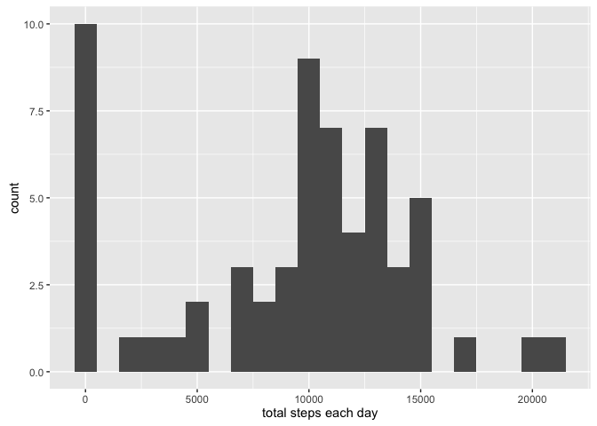
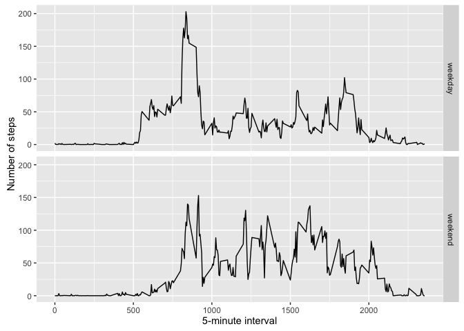

# Reproducible Research: Peer Assessment 1


## Loading and preprocessing the data

```r
library(ggplot2)
library (dplyr)
```

```
## 
## Attaching package: 'dplyr'
```

```
## The following objects are masked from 'package:stats':
## 
##     filter, lag
```

```
## The following objects are masked from 'package:base':
## 
##     intersect, setdiff, setequal, union
```

```r
library (markdown)
library (knitr)
#  Loading and preprocessing the data
#  Show any code that is needed to
#  Load the data (i.e. 𝚛𝚎𝚊𝚍.𝚌𝚜𝚟())
unzip(zipfile="activity.zip")
data <- read.csv("activity.csv")
data$date <- as.Date(data$date)  # convert to Date object
```
## What is mean total number of steps taken per day?

```r
t_steps <- data %>%
  group_by(date) %>%
  summarise(steps=sum(steps, na.rm=TRUE))
qplot(t_steps$steps, binwidth=1000, xlab="total steps each day")
```

<!-- -->

```r
mean(t_steps$steps, na.rm=TRUE)
```

```
## [1] 9354.23
```

```r
median(t_steps$steps, na.rm=TRUE)
```

```
## [1] 10395
```
## What is the average daily activity pattern?

```r
average <- data %>%
  group_by(interval) %>%
  summarise(steps=mean(steps, na.rm=TRUE))

ggplot(data=average, aes(x=interval, y=steps)) +
  geom_line() +
  xlab("5-minute interval") +
  ylab("average number of steps taken")
```

<!-- -->

```r
# Which 5-minute interval, on average across all the days in the dataset, 
# contains the maximum number of steps?
average[which.max(average$steps),]
```

```
## Source: local data frame [1 x 2]
## 
##   interval    steps
##      (int)    (dbl)
## 1      835 206.1698
```


## Imputing missing values

```r
missing <- is.na(data$steps)
table(missing)
```

```
## missing
## FALSE  TRUE 
## 15264  2304
```

```r
# Devise a strategy for filling in all of the missing values in the dataset. 
# The strategy does not need to be sophisticated. For example, 
# you could use the mean/median for that day, or the mean for that 5-minute interval, etc.
# Replace each missing value with a zero

for (i in 1:dim(data)[1]){
  ifelse ((!is.na(data$steps[i])),  data$steps[i]<- data$steps[i], data$steps[i]<- 0)
}

# Create a new dataset that is equal to the original dataset but with the missing data filled in.
# Make a histogram of the total number of steps taken each day and 
# Calculate and report the mean and median total number of steps taken per day.

t2_steps <- data %>%
  group_by(date) %>%
  summarise(steps=sum(steps, na.rm=TRUE))
qplot(t_steps$steps, binwidth=1000, xlab="total steps each day")
```

<!-- -->

```r
mean(t_steps$steps, na.rm=TRUE)
```

```
## [1] 9354.23
```

```r
median(t_steps$steps, na.rm=TRUE)
```

```
## [1] 10395
```
## Are there differences in activity patterns between weekdays and weekends?

```r
 data <- mutate(data, day.of.week = weekdays(date)) 

  data.weekend <- filter (data, day.of.week %in% c("Saturday", "Sunday"))
  data.weekend <- mutate(data.weekend , weekend_or_weekday = 'weekend')
  
  data_weekday <- filter (data, day.of.week %in% c("Monday", "Tuesday", "Wednesday", "Thursday", "Friday"))
  data_weekday <- mutate(data_weekday, weekend_or_weekday = 'weekday')

data <- rbind(data_weekday, data.weekend)
## ------------------------------------------------------------------------
averages <- aggregate(steps ~ interval + weekend_or_weekday, data = data, mean)
ggplot(averages, aes(interval, steps)) + geom_line() + facet_grid(weekend_or_weekday ~ .) +
    xlab("5-minute interval") + ylab("Number of steps")
```

<!-- -->

